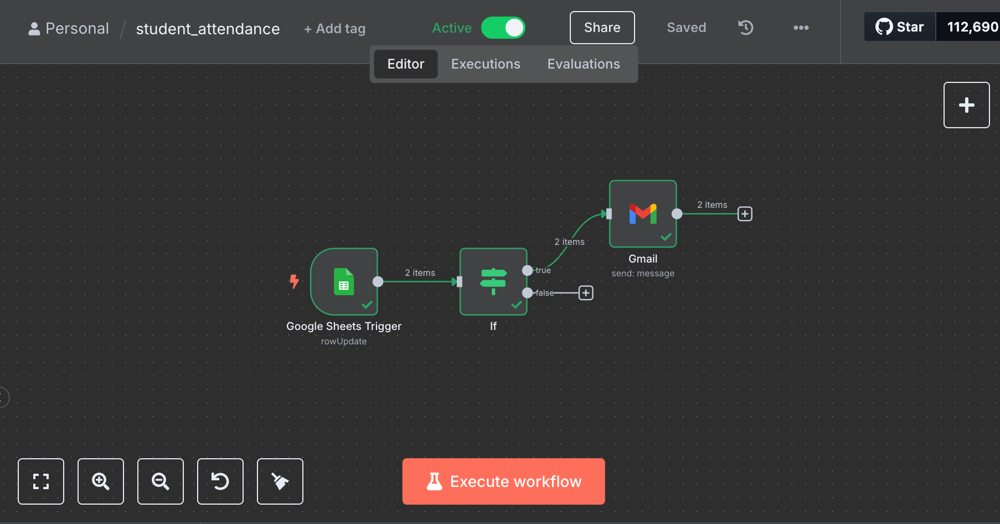
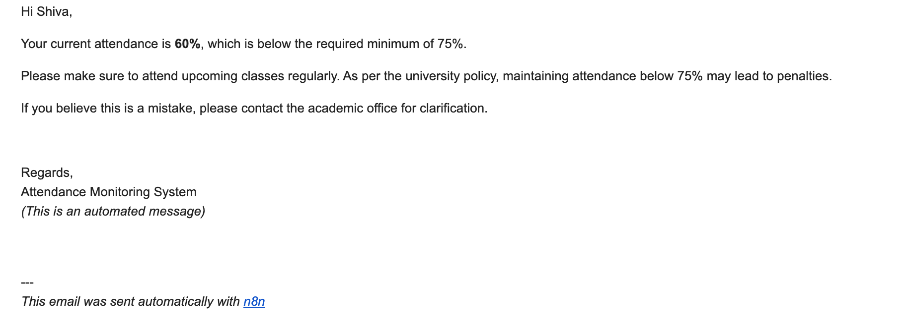

# 📧 Attendance Alert Automation using n8n

This project is an automated workflow built with [n8n](https://n8n.io/) that monitors student attendance and sends alert emails if the attendance percentage drops below the minimum threshold (75%).

> ⚠️ A powerful tool for academic institutions to proactively manage student engagement and avoid attendance-related penalties.

---

## 🚀 Features

- ✅ Automatically checks student attendance
- ✅ Sends personalized email alerts via Gmail
- ✅ Custom warning message for attendance below 75%
- ✅ Integrates easily with databases or Google Sheets
- ✅ Fully customizable and extendable

---

## 🛠️ Tech Stack

- [n8n](https://n8n.io/) – Low-code workflow automation
- Gmail API – For sending emails
- MySQL / Google Sheets (optional) – To fetch student data
- JSON / Set Nodes – To hold dynamic variables

---

## 📸 Screenshots

| n8n Workflow Overview | Email Output |
|-----------------------|--------------|
|  |  |

---

## 📂 Files Included

| File | Description |
|------|-------------|
| `attendance-alert-workflow.json` | Exported n8n workflow file |
| `README.md` | This documentation |
| `screenshots/` | Folder with workflow and email preview screenshots |
| `LICENSE` | MIT License for open-source use |

---

## ✉️ Email Message Format

Here’s the email content sent automatically:

